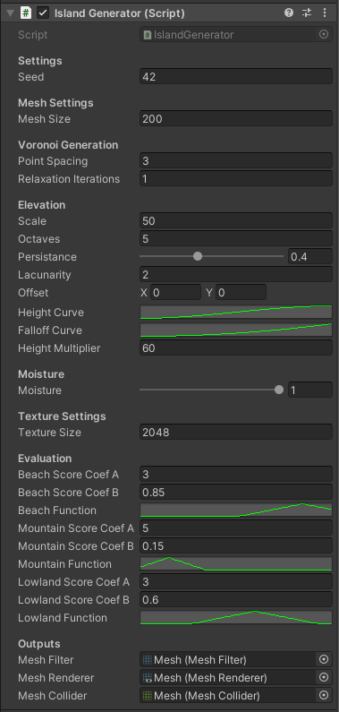
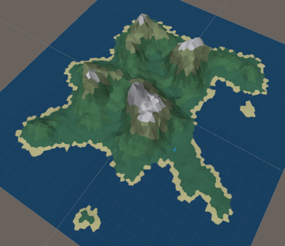
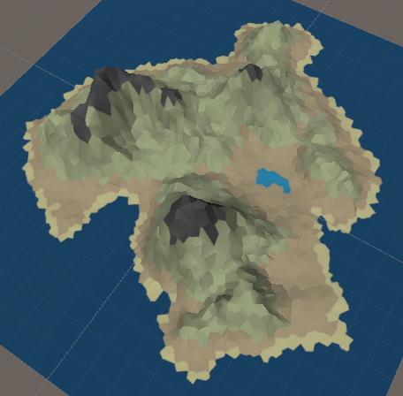

# Polygon Graph based Island Generation for "Sea of Thieves" like games

The proposed method is based on the construction of Voronoi diagrams combined with Delaunay triangulation. 
This method helps to produce less number of separated lands compared to simple noise-based algorithms.

More information is available in the project [report](./report/PCG_Project_Report.pdf).

# Method

The method is first proposed by [A. Patel (2010)](http://www-cs-students.stanford.edu/~amitp/game-programming/polygon-map-generation/) who used the graph structure to model maps by gameplay constraints like elevation, river flow and etc., with noise functions for coastline shapes, river, and tree placement. 
[M. Dangschat and Weweler (2017)](https://yweweler.de/downloads/articles/procedural-generation-of-3d-maps-a-study-of-polygon-graph-based-map-meneration/report-patel10-stanford.pdf) in their work make an improvement over the method using it for 3d map generation. The general pipeline of the proposed method is defined to be like this:

1. Generation of random points
2. Calculation of Voronoi and Delaunay polygons based on the points. 
3. Apply Lloyd relaxation to make polygons less "clumsy" and makes them closer to quasi-randomness.
4. Generate the elevation map using Perlin noise maps and a falloff map
5. Now, the knowledge about the elevation and a moisture parameter can be used for the assignment of biomes.
6. Finally, we create a mesh and apply the texture to it.
7. In the end, we also evaluate the generated island according to some metrics.

## Program Usage

### Prerequisites

You need to have the Unity3d engine installed.

### Run the application

Open the scene `/Asset/Scenes/project.unity` and press **Run** button.

### Change parameters

In case you want to change the default parameters of the island generation, 
click the Island object and you will see a bar with changeable settings:

  

## Examples

| Generated island with high moisture | Generated island with high moisture | 
| :------------- | :------------- |
|  |  |
| **Evaluation Results**: <ul><li>Max Score: 0.86 Number of Components: 3</li><li>Coastline Beach Coverage: 0.80 Beach Score: 0.86</li><li>Mountain Cover Percentage: 0.18 Mountain Score: 0.83</li><li>Lowland Cover Percentage: 0.48 Lowland Score: 0.64 </li></ul>| **Evaluation Results**: <ul><li>Max Score: 0.95 Number of Components: 1</li><li>Coastline Beach Coverage: 0.76 Beach Score: 0.72</li><li>Mountain Cover Percentage: 0.16 Mountain Score: 0.95</li><li>Lowland Cover Percentage: 0.42 Lowland Score: 0.45</li></ul>|

## References

1. Lague, S. (2017). Procedural Landmass Generation. Accessed at https://github.com/SebLague/Procedural-Landmass-Generation.
2. jceipek. Unity-delaunay. Accessed at https://github.com/jceipek/Unity-delaunay.

